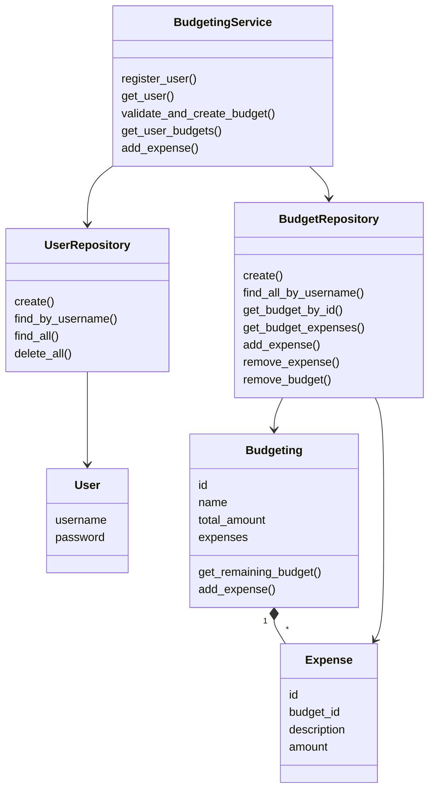
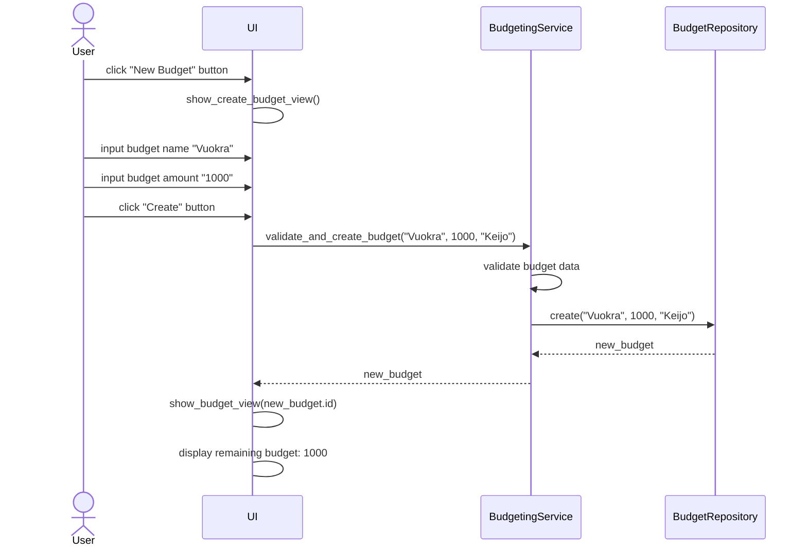

# Arkkitehtuurikuvaus
## Rakenne

Ohjelma noudattaa kolmitasoista kerrosarkkitehtuuria. Koodin pakkausrakenne seuraavanlainen: 
*kuva tulossa*

## Käyttöliittymä

Käyttöliittymässä on neljä eri näkymää:

- kirjautuminen
- uuden käyttäjän rekisteröinti
- valikko
- budjettien hallinta
- budjettien visualisointi

Näkymistä yksi on aina kerrallaan näkyvissä. Näkymien hallinnasta vastaa BudgetingUI-luokka. Käyttöliittymä on pyritty eristämään sovelluslogiikasta: se ainoastaan kutsuu BudgetingService-luokan metodeja.

Kun sovelluksen tila muuttuu (esim. käyttäjä kirjautuu, budjetti tai kulu lisätään/poistetaan), näkymä päivitetään kutsumalla näkymän omaa päivitysmetodia, joka hakee tarvittavat tiedot sovelluslogiikalta ja rendaa näkymän uudelleen.
  
## Luokkakaavio

## Sekvenssikaavio
Uuden budjetin luominen

