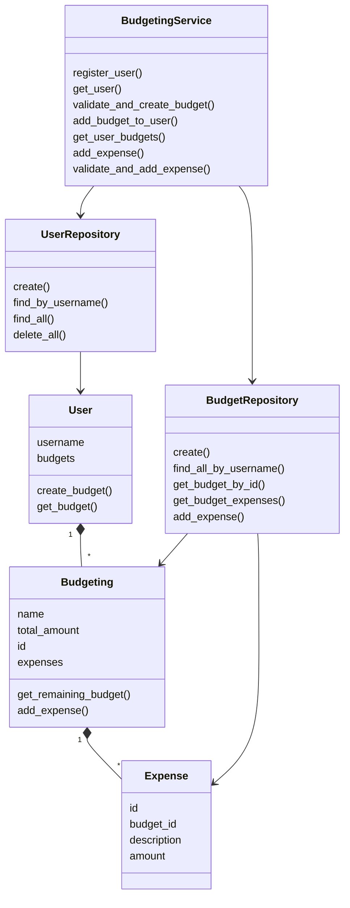
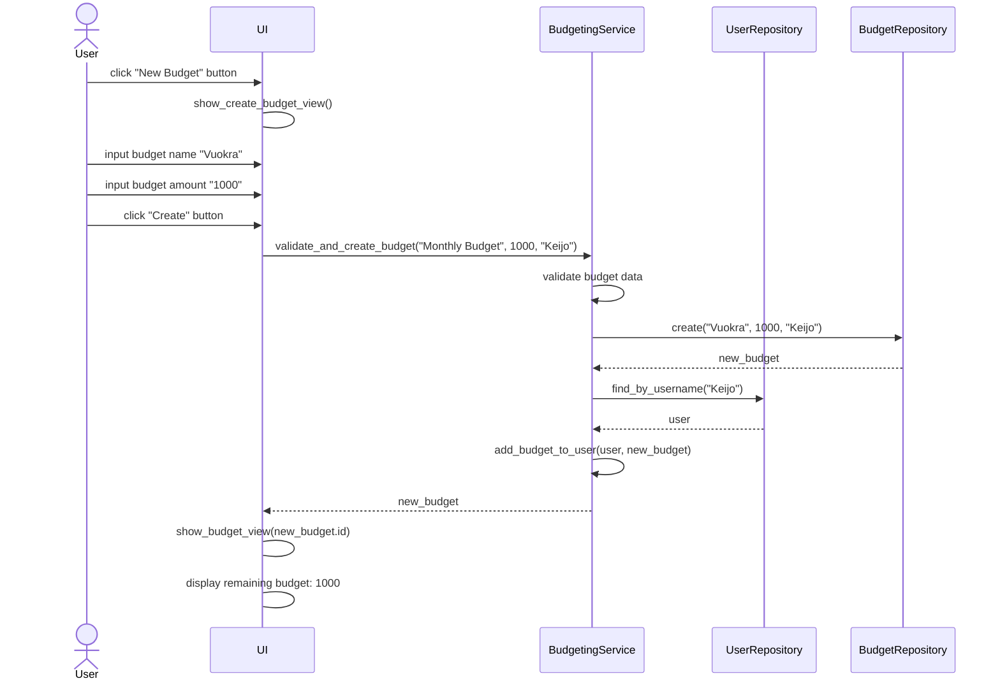

# Arkkitehtuurikuvaus

## Luokkakaavio

```mermaid
classDiagram
    class User {
        username
        budgets
        create_budget()
        get_budget()
    }
    
    class Budgeting {
        name
        total_amount
        id
        expenses
        get_remaining_budget()
        add_expense()
    }
    
    class Expense {
        id
        budget_id
        description
        amount
    }
    
    class BudgetingService {
        register_user()
        get_user()
        validate_and_create_budget()
        add_budget_to_user()
        get_user_budgets()
        add_expense()
        validate_and_add_expense()
    }
    
    class UserRepository {
        create()
        find_by_username()
        find_all()
        delete_all()
    }
    
    class BudgetRepository {
        create()
        find_all_by_username()
        get_budget_by_id()
        get_budget_expenses()
        add_expense()
    }
    
    User "1" *-- "*" Budgeting
    Budgeting "1" *-- "*" Expense
    BudgetingService --> UserRepository
    BudgetingService --> BudgetRepository
    UserRepository --> User
    BudgetRepository --> Budgeting
    BudgetRepository --> Expense
```

## Sekvenssikaavio
Uuden budjetin luominen

```mermaid
sequenceDiagram
  actor User
  participant UI
  participant BudgetingService
  participant UserRepository
  participant BudgetRepository
  
  User->>UI: click "New Budget" button
  UI->UI: show_create_budget_view()
  User->>UI: input budget name "Vuokra"
  User->>UI: input budget amount "1000"
  User->>UI: click "Create" button
  UI->>BudgetingService: validate_and_create_budget("Monthly Budget", 1000, "Keijo")
  BudgetingService->>BudgetingService: validate budget data
  BudgetingService->>BudgetRepository: create("Vuokra", 1000, "Keijo")
  BudgetRepository-->>BudgetingService: new_budget
  BudgetingService->>UserRepository: find_by_username("Keijo")
  UserRepository-->>BudgetingService: user
  BudgetingService->>BudgetingService: add_budget_to_user(user, new_budget)
  BudgetingService-->>UI: new_budget
  UI->UI: show_budget_view(new_budget.id)
  UI->UI: display remaining budget: 1000
```
