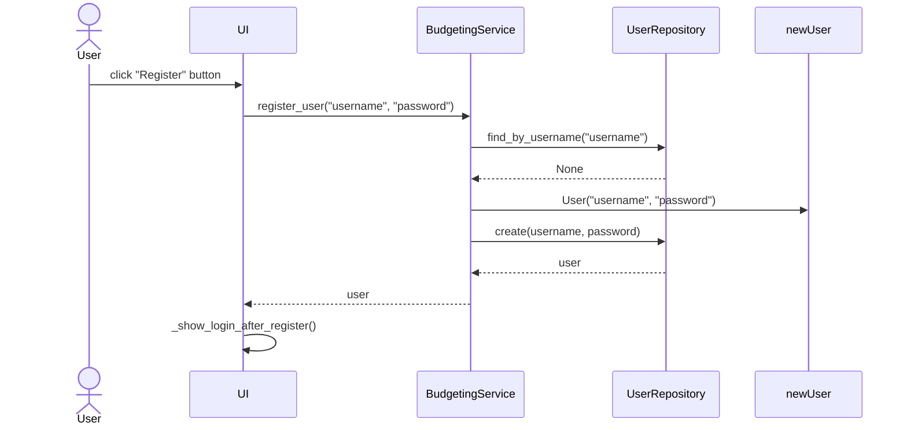
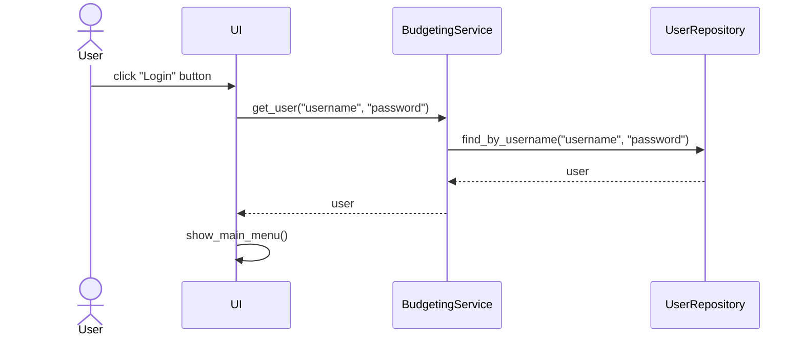
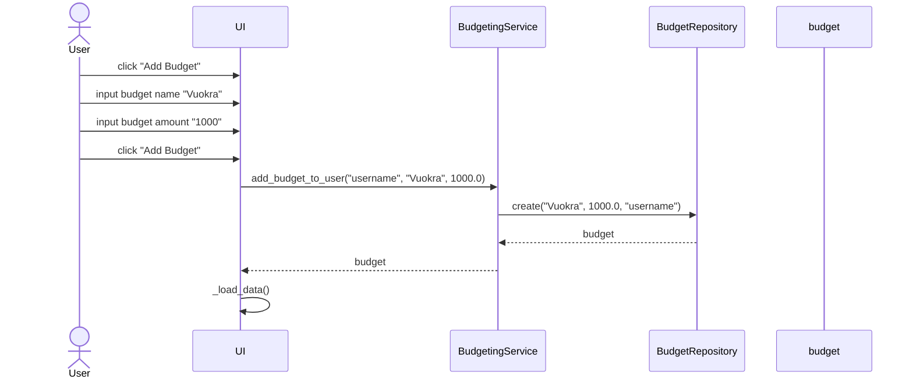
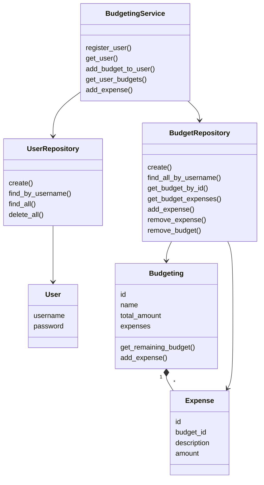

# Arkkitehtuurikuvaus
## Rakenne

Ohjelma noudattaa kolmitasoista kerrosarkkitehtuuria. Koodin pakkausrakenne seuraavanlainen: 

Rakenne jakautuu seuraavasti:
- ui: Sisältää käyttöliittymästä vastaavan koodin
- services: Sisältää sovelluslogiikasta vastaavan koodin
- repositories: Sisältää tietojen pysyväistallennuksesta vastaavan koodin
- entities: Sisältää luokkia, jotka kuvastavat sovelluksen käyttämiä tietokohteita

## Käyttöliittymä

Käyttöliittymässä on neljä eri näkymää:

- kirjautuminen
- uuden käyttäjän rekisteröinti
- valikko
- budjettien hallinta

Näkymistä yksi on aina kerrallaan näkyvissä. Näkymien hallinnasta vastaa BudgetingUI-luokka. Käyttöliittymä on pyritty eristämään sovelluslogiikasta: se ainoastaan kutsuu BudgetingService-luokan metodeja. Sovelluksen tilan muuttuessa (esim. käyttäjä kirjautuu, budjetti tai kulu lisätään/poistetaan), näkymä päivitetään kutsumalla näkymän omaa päivitysmetodia, joka hakee tarvittavat tiedot sovelluslogiikalta ja rendaa näkymän uudelleen.

Budjettien hallintanäkymä on jaettu pienempiin komponentteihin selkeyden vuoksi:

- BudgetTab
- ExpenseTab
- BudgetSelector
- BudgetSummary
- ExpenseHistory

## Päätoiminnallisuudet

### Rekisteröityminen

Rekisteröityessä käyttäjä antaa käyttäjänimen sekä salasanan. Tapahtumankäsittelijä kutsuu BudgetingService-luokan metodia `register_user`, joka tarkistaa samalla UserRepositorya hyödyntäen onko käyttäjänimi jo varattu. Mikäli se ei ole varattu käyttäjä ohajataan ilmoituksen saattelemana kirjautumisnäkymään.

### Kirjautuminen

Kirjautuessa käyttäjä syöttää käyttäjänimen sekä salasanan, jonka BudgetingService välittää metodille `get_user.` Metodi hyödyntää UserRepositorya, joka tarkistaa tiedot tietokannasta ja tarkastaa salasanan. Kaiken onnistuessa siirrytään päävalikkoon eli "menuun".

### Uuden budjetin luominen

Uutta budjettia luodessa käyttäjä antaa sille nimen ja summan. Nappia painaessa se kutsuu BudgetingService-luokan metodia `add_budget_to_user`, joka tarkistaa syöteen ja tallentaa sen tietokantaan. Käyttöliittymä päivittyy oikeaksi kutsumalla metodia `_load_data()`. 

## Tietojen tallennus

Sovellus tallentaa tiedot SQLite-tietokantaan. Tietokannassa on kolme taulua:

- users: Käyttäjien tiedot (id, username, password)
- budgets: Budjettien tiedot ( id, name, total_amount, user_id)
- expenses: kulujen tiedot (id, description, amount, budget_id)

Tietokantaa käsittelevät luokat UserRepository ja BudgetRepository. 

## Luokkakaavio

Kaaviossa sovelluksen tärkeimmät luokat sekä niiden suhteet. Yhdellä budjetilla voi olla monta taulua, BudgetinService käyttää molepia repository-luokkia, joilla taas on omia tietueitaan. 

## Heikkoudet

- resetoidessa budjetteja täytyy palata menuun tai lisätä uusi budjetti nähdäkseen muutokset
- käyttäjätunnus ja salasana voivat olla mahdottoman pitkiä (tälläisessä sovelluksessa ei vakavaa)
