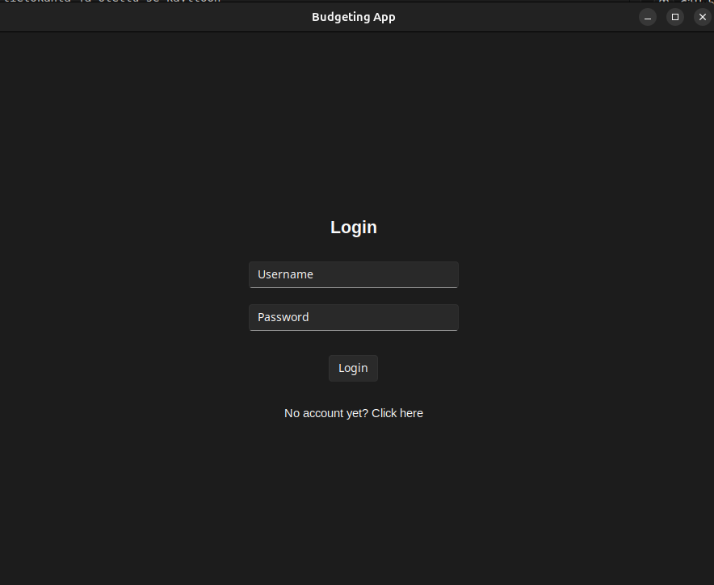
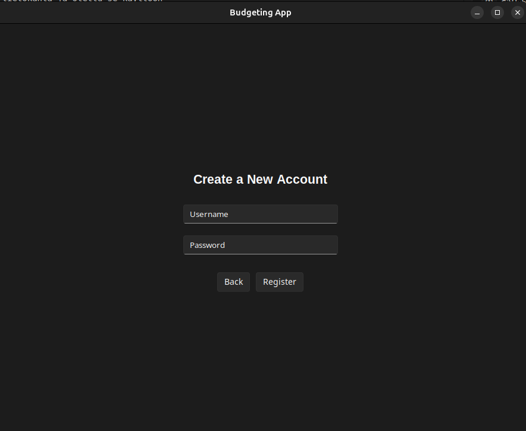
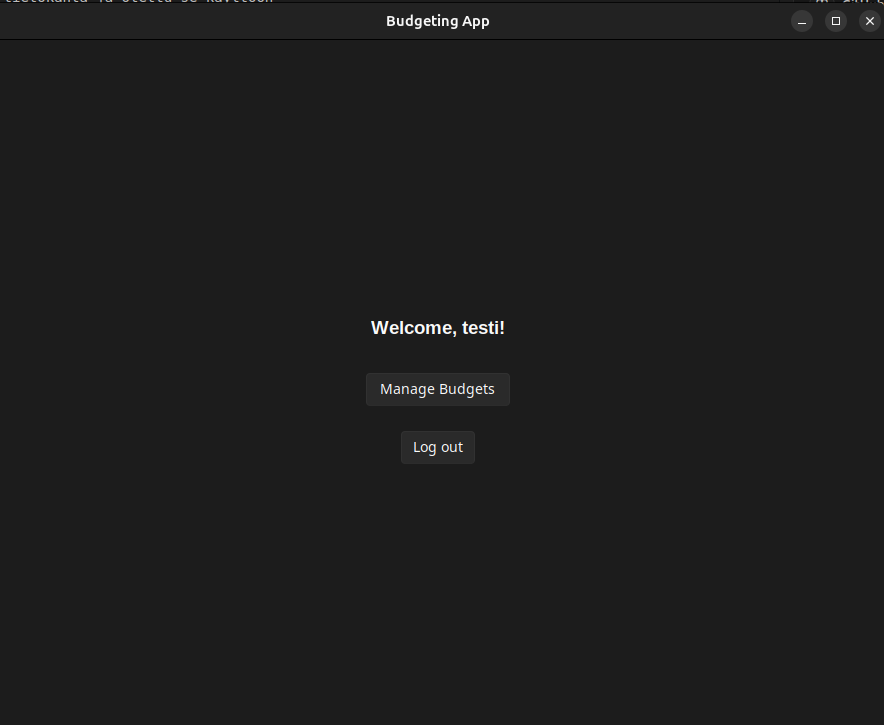
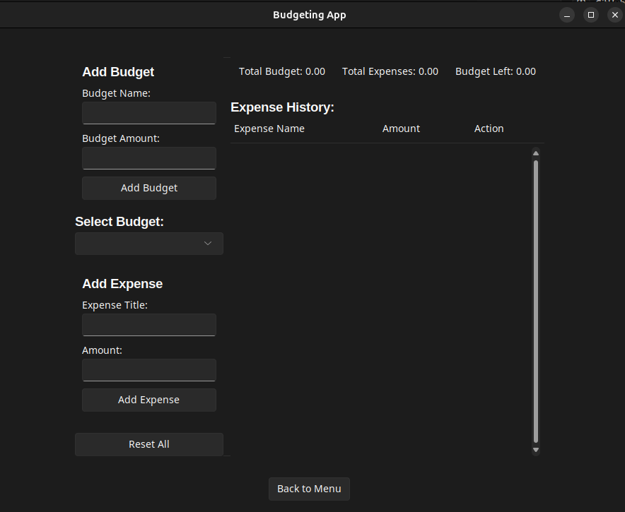

# Käyttöohje 

Lataa sovelluksen viimeisin [release](https://github.com/NuuNiem/ot-harjoitustyo/releases) valitsemalla _Source code_.

## Sovelluksen käynnistys 

1. Siirry hakemistoon budgeting-app:

```bash
cd budgeting-app
```
2. Asenna riippuvuudet komennolla:
   
```bash
poetry install
```

3. Käynnistä sovellus komennolla:
```bash
poetry run invoke start
```

## Kirjautuminen 

Aloitusnäkymänä toimii kirjautumisnäkymä:



Syöttämällä olemassa olevan käyttäjän tunnuksen ja salasanan ja painamalla "Login" pääsee menuun. 

## Rekisteröityminen 

Uuden käyttäjän luominen onnistuu painalla aloitusnäkymän alla olevaa "No account yet? Click here", josta avautuu rekisteröintinäkymä. 



Uusi käyttäjä luodaan syöttämällä tunnus ja salasana kenttiin, jonka jälkeen painetaan "Register". Mikäli tunnuksen luonti onnistuu tulee ponnahdusikkuna ja siirrymme takaisin kirjautumisnäkymään. 

## Navigointi 

Kun käyttäjä on kirjautunut aukeaa menu, jossa on vain yksi nappi. Painamalla kyseistä nappia päästään budjetin hallintaan.



## Budjettien hallinta

Näkymässä käyttäjä voi lisätä uuden budjetin syöttämällä vasempaan yläkulmaan budjetin nimen sekä sen summan. Budjetti ilmestyy tämän jälkeen select budget valikkoon sen alle. 
Kuluja voimme lisätä sillä hetkellä valittuun budjettiin, jotka voi taas nimetä sekä antaa summan. 

Tieto kuluista on oikealla, josta niitä voidaan myös poistaa remove-napin avulla.
Ylhäällä näkyy yhteenveto valitusta budjetista. "Reset All" poistaa kaikki tekemäsi budjetit ponnahdusikkunan kautta.

Uloskirjautuminen tapahtuu painamalla "Back to menu", jonka jälkeen valikossa valitaan "Log out"





