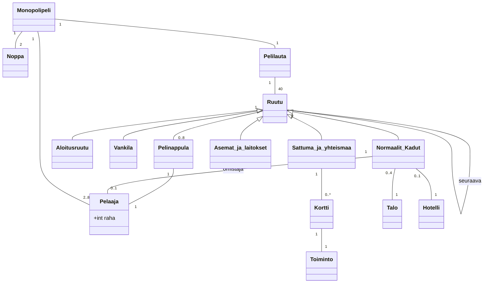

```mermaid
classDiagram
Monopolipeli "1" -- "2" Noppa
Monopolipeli "1" -- "1" Pelilauta
Pelilauta "1" -- "40" Ruutu
Ruutu "1" -- "1" Ruutu : seuraava
Ruutu "1" -- "0..8" Pelinappula
Pelinappula "1" -- "1" Pelaaja
Pelaaja "2..8" -- "1" Monopolipeli

Ruutu <|-- Aloitusruutu
Ruutu <|-- Vankila
Ruutu <|-- Sattuma_ja_yhteismaa
Ruutu <|-- Asemat_ja_laitokset
Ruutu <|-- Normaalit_Kadut

Sattuma_ja_yhteismaa "1" -- "0..*" Kortti
Kortti "1" -- "1" Toiminto
Normaalit_Kadut "0..4" -- "1" Talo
Normaalit_Kadut "0..1" -- "1" Hotelli
Normaalit_Kadut "1" -- "0..1" Pelaaja : omistaja
Pelaaja : +int raha
```
